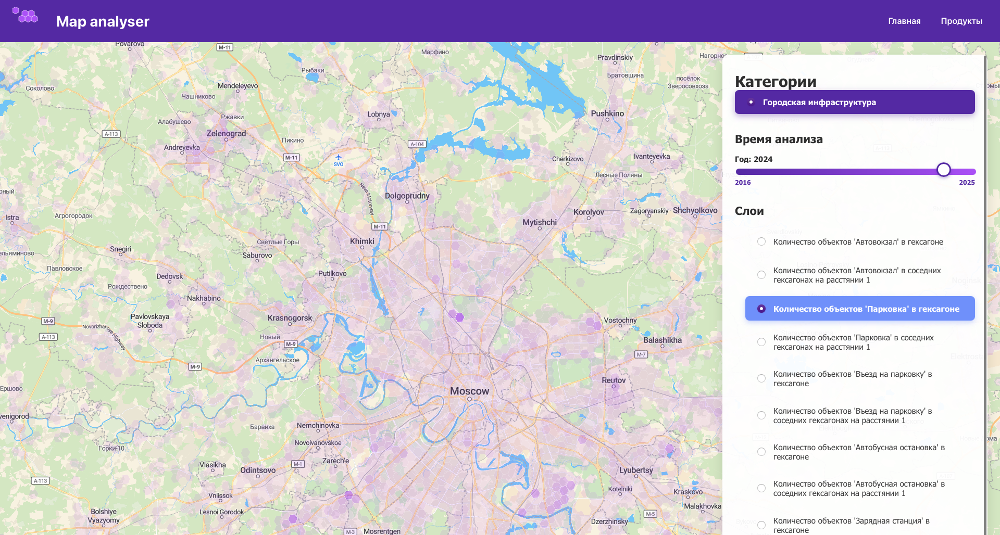

# business-analytics-frontend

## Requirements

Add .env file to root project folder and fill fields:
    
- `REACT_APP_MAP_API_URL` - API URL from [maptiler](https://www.maptiler.com)
- `REACT_APP_BACKEND_URL` - API URL of your backend. 
